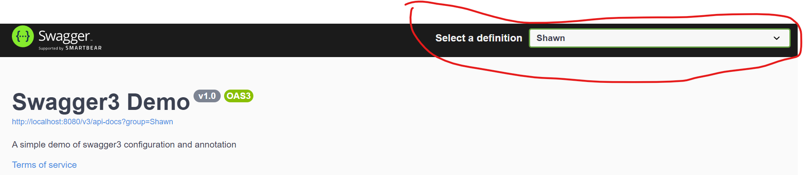

# swagger基础使用
## 导入依赖（v3）
~~~xml
<!--pom.xml-->
<dependency>
    <groupId>io.springfox</groupId>
    <artifactId>springfox-boot-starter</artifactId>
    <version>3.0.0</version>
</dependency>
~~~

## 修改配置
在运行类xxxApplication.java上添加EnableOpenApi注解

~~~Java

import org.springframework.boot.SpringApplication;
import org.springframework.boot.autoconfigure.SpringBootApplication;
import springfox.documentation.oas.annotations.EnableOpenApi;

@EnableOpenApi
@SpringBootApplication
public class SwaggertestApplication {

    public static void main(String[] args) {
        SpringApplication.run(SwaggertestApplication.class, args);
    }

}

~~~

在application.yml里添加：
~~~yaml
spring:
  mvc:
    pathmatch:
      matching-strategy: ant_path_matcher
~~~
然后打开localhost:8080/swagger-ui/就可以看到swagger-ui的页面了

## 常用配置注解
@Api： 用于请求的controller类上，标识对类的说明
- tags: "说明类的作用，在界面上可以看到"
- value： "在界面上无法看到，没有意义，一般不配置"

@ApiOperation: 用于请求的controller方法上，说明方法的用途和作用
- value： "说明方法的用途和作用"
- notes: "方法的备注说明"

@ApiImplicitParams: 用在请求的controller方法上，表示一组参数说明
* @ApiImplicitParam: 用在ApiImplicitParams注解中，指定一个请求参数的各个方面
    * name: 参数名
    * value: 参数的值说明
    * required: 参数是否必须传
    * paramType： 参数放在哪个地方
        * header --> 请求参数的获取： @RequestHeader
        * query -->请求参数的获取： @RequestParam
        * path --> (用于restful接口) --> 请求参数的获取： @pathVariable
        * div --> 不常用
        * form --> 不常用
    * dataType: 参数类型，默认String,其他值使用dataType=""来设定，如 dataType = "Integer"
    * defaultValue: 参数的默认值

@ApiModel: 用在实体类上,表示返回对象的信息。 另外也可以标记在作为参数传递的实体类上，当在controller方法中使用这个实体类时不需要再使用ApiImplicitParams注解
* @ApiModelProperty: 用在实体类的属性上，添加和操作模型属性的数据
  * value: 属性简要说明
  * name： 重写属性名称
  * required: 是否为必传参数
  * dataType: 参数的数据类型,默认为从类属性读取的数据类型
  * allowEmptyValue: true为允许传空值

@ApiResponses: 用在controller方法上，表示一组响应
* @ApiResponse: 用在ApiResponses注解内，一般用于表示一个错误的响应信息
  * code: 数字,例如404
  * message：信息，例如"请求参数没填好"
  * response: 抛出异常的类

## Swagger3 API信息配置
新建config包，在包里新建SwaggerConfig配置类，就可以利用ApiInfo类来配置API信息。
~~~Java
@Configuration
public class SwaggerConfig {
    @Bean
    public Docket createApi(){
        return new Docket(DocumentationType.OAS_30)
                .apiInfo(createApiInfo());
    }

    private ApiInfo createApiInfo(){
        return new ApiInfo(
                "Swagger3 Demo", //title
                "A simple demo of swagger3 configuration and annotation",  //description
                "v1.0",     //version
                "http://www.shawnDeveloper.ca",     //url
                new Contact("Shawn Huang","http://www.shawnDeveloper.ca","hawkhxf2000@gmail.com"),  //contact info
                "Apache 2.0",  //license
                "http://www.apache.org/licenses/LICENSE-2.0",  //licenseUrl
                new ArrayList<>()    //don't know what this for, so just left it default
                );
    }
}
~~~

## Swagger3 Docket开关&过滤&分组配置详解
### Docket开关
**swagger仅仅在开发阶段使用，在生产阶段需要关闭，否则可能带来安全问题和性能问题，**
默认为Swagger开启，可以在Docket构造器中使用.enable(false)关闭
~~~Java
@Configuration
public class SwaggerConfig {
    @Bean
    public Docket createApi(){
        return new Docket(DocumentationType.OAS_30)
                .apiInfo(createApiInfo()).
                enable(false);
    }
~~~

### Docket设置过滤
- 有些情况，我们需要指定固定包路径下的类生成API，或者根据前端用户路径请求过滤。  
- 使用过滤必须先调用select方法
* 通过apis方法中的RequestHandlerSelectors来配置：
  * basePackage: 生成特定包内的API
  * any： 所有包
  * none: 所有包均无效
  * withClassAnnotation: 根据类注解
  * withMethodAnnotation: 根据方法注解  

一般使用basePackage方法来进行配置
~~~Java
@Bean
    public Docket createApi(){
        return new Docket(DocumentationType.OAS_30)
                .select()
                .apis(RequestHandlerSelectors.basePackage("com.example.swaggertest.controller"))
                .build()
                .apiInfo(createApiInfo());
    }
~~~
注意build()需要在apiInfo方法前面

### Docket设置分组
在实际项目开发中，把复杂项目划分成多模块给多个小组或多个个人负责开发，所以每个小组或者个人需要实现自己的分组，方便查找到API接口开发负责人，沟通和处理问题;  
可以通过groupName方法来设置组名
~~~Java
 @Bean
public Docket createApi(){
        return new Docket(DocumentationType.OAS_30)
        .groupName("Shawn")
        .select()
        .apis(RequestHandlerSelectors.basePackage("com.example.swaggertest.controller"))
        .build()
        .apiInfo(createApiInfo());
        }
~~~

红圈中为分组的显示

可以通过设置不同的basePackage包来划分不同的组的API
